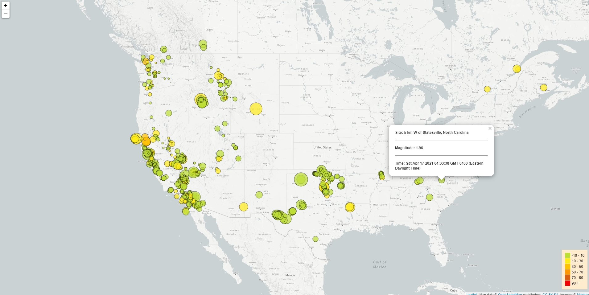

# Visualizing Data with Leaflet

## Background

Tools used: Mapbox, Leaflet (V1.6), HTML5, CSS

Help to visualize the United States Geological Survey (USGS) earthquake data.

## Steps Taken

### Visualization

1. **Get data set**

   The USGS provides earthquake data in a number of different formats, updated every 5 minutes. 
   Gathered data from: [USGS GeoJSON Feed](http://earthquake.usgs.gov/earthquakes/feed/v1.0/geojson.php) page and selected the dataset 'All Earthquakes from the Past 7 Days'. Used this URL endpoint (JSON format) to pull in the data for the visualization.

2. **Import & Visualize the Data**

   Created a map using Leaflet that plots all of the earthquakes from the data set based on their longitude and latitude.

   * The data markers on the map reflect the magnitude of the earthquake by their size and depth of the earth quake by color. Earthquakes with higher magnitudes appear larger and earthquakes with greater depth appear darker in color.

   * Bind popups: when a marker is clicked, additional information is presented.

   * Added a legend that provides context for the map data.
